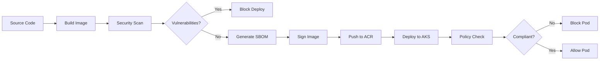

# Zero Trust Azure Container Registry (ACR) with AKS Integration

A production-ready, enterprise-grade Zero Trust implementation of Azure Container Registry with comprehensive AKS integration, security controls, and compliance capabilities.

## Architecture Overview

This solution implements a Zero Trust security model for container workloads with the following key components:

- **Private Azure Container Registry** - No public access, private endpoints only
- **Azure Kubernetes Service (AKS)** - Private cluster with advanced security features
- **Comprehensive Security Controls** - Image scanning, signing, SBOM generation
- **Policy Enforcement** - Kyverno/Gatekeeper admission controllers
- **Monitoring & Compliance** - Full audit trail and regulatory compliance

```
┌─────────────────────────────────────────────────────────────┐
│                    Azure Subscription                       │
│                                                             │
│  ┌──────────────────┐  ┌──────────────────┐                │
│  │   Hub VNet       │  │   AKS Spoke      │                │
│  │ ┌──────────────┐ │  │ ┌──────────────┐ │                │
│  │ │ACR Private   │ │  │ │AKS Cluster   │ │                │
│  │ │Endpoint      │ │  │ │- Signed Only │ │                │
│  │ └──────────────┘ │  │ │- Policy Enf. │ │                │
│  └──────────────────┘  │ │- Monitoring  │ │                │
│                        │ └──────────────┘ │                │
│  ┌──────────────────┐  └──────────────────┘                │
│  │   CI/CD Spoke    │                                       │
│  │ ┌──────────────┐ │                                       │
│  │ │Private Build │ │                                       │
│  │ │Agents        │ │                                       │
│  │ └──────────────┘ │                                       │
│  └──────────────────┘                                       │
└─────────────────────────────────────────────────────────────┘
```

## Zero Trust Security Features

### Network Security
- **Private Endpoints Only** - No public access to ACR or AKS API server
- **Network Segmentation** - Hub-spoke topology with micro-segmentation
- **TLS Everywhere** - Encrypted communication for all services
- **Network Policies** - Kubernetes-native network security

### Identity & Access
- **Azure AD Integration** - Centralized identity management
- **Workload Identity** - OIDC-based service authentication
- **RBAC** - Least privilege access controls
- **No Static Secrets** - Managed identities and short-lived tokens

### Supply Chain Security
- **Image Signing** - Notary v2 and Cosign support
- **SBOM Generation** - Software Bill of Materials for all images
- **Vulnerability Scanning** - Continuous security assessment
- **Registry Allowlisting** - Only trusted registries permitted

### Policy Enforcement
- **Admission Control** - Kyverno/Gatekeeper policy enforcement
- **Pod Security Standards** - Kubernetes security baseline
- **Resource Governance** - CPU/memory limits and quotas
- **Compliance Verification** - Automated policy compliance

### Monitoring & Audit
- **Comprehensive Logging** - All security events captured
- **Real-time Monitoring** - Prometheus, Grafana, Azure Monitor
- **Security Analytics** - Falco runtime security monitoring
- **Compliance Reporting** - Automated compliance dashboards

## Regulatory Compliance

This implementation addresses multiple compliance frameworks:

- **ISO/IEC 27001:2022** - Information security management
- **SOC 2 Type II** - Security and availability controls
- **NIST Cybersecurity Framework** - Comprehensive security controls
- **DORA** - Digital operational resilience
- **NIS2** - Network and information security directive

## Quick Start

### Prerequisites

- Azure subscription with appropriate permissions
- Azure CLI (v2.45.0+)
- Terraform (v1.6.0+)
- kubectl (v1.28.0+)

### 1. Clone and Configure

```bash
git clone <repository-url>
cd zero-trust-acr

# Configure variables
cp terraform/terraform.tfvars.example terraform/terraform.tfvars
# Edit terraform.tfvars with your values
```

### 2. Deploy Infrastructure

```bash
cd terraform
terraform init
terraform plan -out=tfplan
terraform apply tfplan
```

### 3. Deploy Security Controls

```bash
# Get AKS credentials
az aks get-credentials --name <aks-name> --resource-group <rg-name>

# Deploy security components
kubectl apply -f kubernetes/namespace-setup.yaml
kubectl apply -f kubernetes/network-policies.yaml
kubectl apply -f security/
kubectl apply -f policies/
kubectl apply -f monitoring/
```

### 4. Setup CI/CD

Choose your CI/CD platform:

- **GitHub Actions**: Use `cicd/github-actions-secure.yaml`
- **Azure DevOps**: Use `cicd/azure-devops-secure.yaml`

### 5. Verify Deployment

```bash
# Run compliance check
./scripts/compliance-check.sh

# Verify all components
kubectl get pods -A
kubectl get policyreports -A
```

## Repository Structure

```
├── terraform/                    # Infrastructure as Code
│   ├── main.tf                  # Core infrastructure
│   ├── acr.tf                   # Container registry configuration
│   ├── aks.tf                   # Kubernetes cluster setup
│   ├── rbac.tf                  # Identity and access management
│   └── variables.tf             # Configuration variables
├── kubernetes/                   # Kubernetes configurations
│   ├── namespace-setup.yaml     # Namespace and RBAC setup
│   └── network-policies.yaml    # Zero Trust networking
├── security/                     # Security components
│   ├── trivy-config.yaml        # Vulnerability scanning
│   ├── sbom-generation.yaml     # Software Bill of Materials
│   ├── notary-v2-setup.yaml     # Image signing (Notary)
│   └── cosign-setup.yaml        # Image signing (Cosign)
├── policies/                     # Policy enforcement
│   ├── kyverno-setup.yaml       # Kyverno installation
│   ├── kyverno-policies.yaml    # Admission control policies
│   └── gatekeeper-policies.yaml # Alternative OPA policies
├── monitoring/                   # Observability stack
│   ├── logging-config.yaml      # Centralized logging
│   └── security-monitoring.yaml # Security event monitoring
├── cicd/                        # CI/CD pipelines
│   ├── github-actions-secure.yaml    # GitHub Actions workflow
│   ├── azure-devops-secure.yaml      # Azure DevOps pipeline
│   └── private-build-agents.yaml     # Self-hosted agents
└── docs/                        # Documentation
    ├── architecture-design.md   # Detailed architecture documentation
    ├── COST_ANALYSIS.md        # Comprehensive cost breakdown analysis
    ├── PROJECT_SUMMARY.md      # Complete project summary and deliverables
    ├── deployment-guide.md     # Step-by-step deployment instructions
    ├── security-policies.md    # Security policies and procedures
    └── compliance-framework.md # Regulatory compliance details
```

## Security Controls

### Image Security Pipeline



### Policy Enforcement Layers

1. **Build-time** - Dockerfile and dependency scanning
2. **Registry** - Image vulnerability and compliance checks
3. **Admission** - Kubernetes admission controller validation
4. **Runtime** - Continuous monitoring and policy enforcement

## Monitoring and Observability

### Dashboards Available

- **Security Dashboard** - Real-time security posture
- **Compliance Dashboard** - Regulatory compliance status
- **Performance Dashboard** - Application and infrastructure metrics
- **Cost Dashboard** - Resource utilization and costs

### Key Metrics

- Image vulnerability count and severity
- Policy violation trends
- Authentication and authorization events
- Network security events
- Compliance score and drift

## Configuration Options

### ACR Configuration

```yaml
# Key configuration options
retention_days_untagged: 7
enable_zone_redundancy: true
geo_replication_locations: ["westus2", "centralus"]
cmk_enabled: true
quarantine_policy_enabled: true
```

### AKS Security Configuration

```yaml
# Security features
enable_azure_policy: true
enable_workload_identity: true
enable_secret_store_csi: true
enable_defender_for_containers: true
private_cluster_enabled: true
```

### Policy Configuration

```yaml
# Policy enforcement
admission_controller: kyverno  # or gatekeeper
validation_failure_action: enforce
background_scan: true
policy_exceptions: []
```

## Troubleshooting

### Common Issues

1. **ACR Access Denied**
   ```bash
   # Check private endpoint connectivity
   nslookup <acr-name>.azurecr.io
   # Verify managed identity permissions
   az role assignment list --assignee <identity-id>
   ```

2. **Policy Violations**
   ```bash
   # Check policy reports
   kubectl get policyreport -A
   # View specific violations
   kubectl describe policyreport <name> -n <namespace>
   ```

3. **Image Pull Failures**
   ```bash
   # Verify service account configuration
   kubectl describe serviceaccount <sa-name> -n <namespace>
   # Check workload identity setup
   kubectl describe federatedidentity
   ```

## Documentation

- [**Project Summary**](docs/PROJECT_SUMMARY.md) - Complete project overview, technologies used, and deliverables
- [**Architecture Design**](docs/architecture-design.md) - Detailed technical architecture and design decisions
- [**Cost Analysis**](docs/COST_ANALYSIS.md) - Comprehensive cost breakdown and optimization strategies
- [**Deployment Guide**](docs/deployment-guide.md) - Step-by-step deployment instructions
- [**Security Policies**](docs/security-policies.md) - Security policies and procedures
- [**Compliance Framework**](docs/compliance-framework.md) - Regulatory compliance details

## Contributing

1. Fork the repository
2. Create a feature branch
3. Make changes and add tests
4. Ensure compliance checks pass
5. Submit a pull request

## License

This project is licensed under the MIT License - see the [LICENSE](LICENSE) file for details.

## Support

- Create an [issue](../../issues) for bug reports
- Join our [discussions](../../discussions) for questions
- Review [documentation](docs/) for detailed guides
- Check [troubleshooting](docs/deployment-guide.md#troubleshooting-common-issues) for common issues

## Features

- Zero Trust network architecture
- Private endpoints and network isolation
- Azure AD authentication and RBAC
- Container image signing and verification
- Vulnerability scanning and SBOM generation
- Policy-based admission control
- Comprehensive audit logging
- Real-time security monitoring
- Multi-framework compliance (ISO 27001, SOC 2, NIST, DORA, NIS2)
- Infrastructure as Code (Terraform)
- GitOps-ready deployment
- Production-grade monitoring and alerting
- Disaster recovery and high availability
- Secure CI/CD pipeline integration

---

**Built for enterprise security and developer productivity**